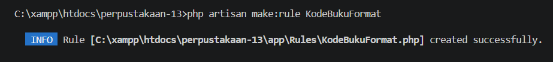
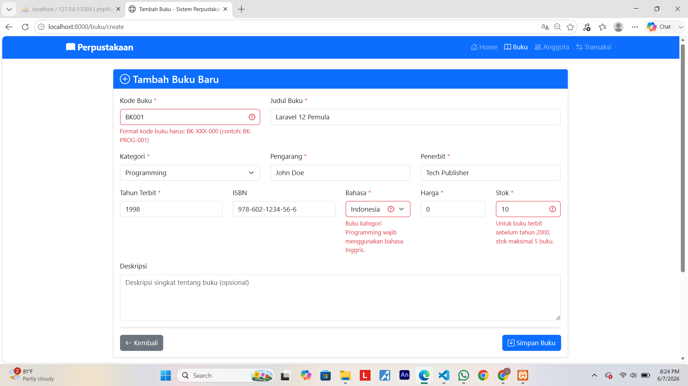
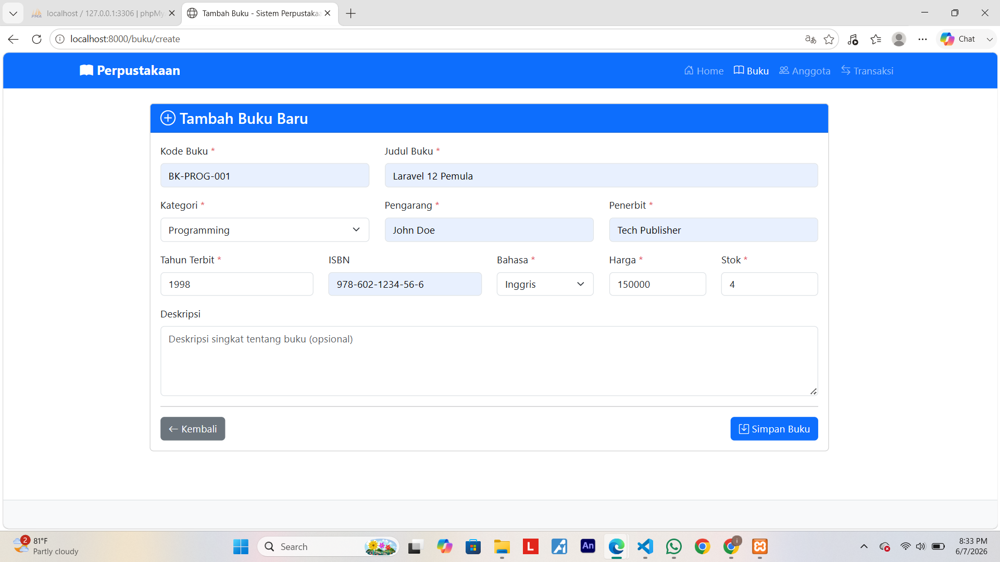
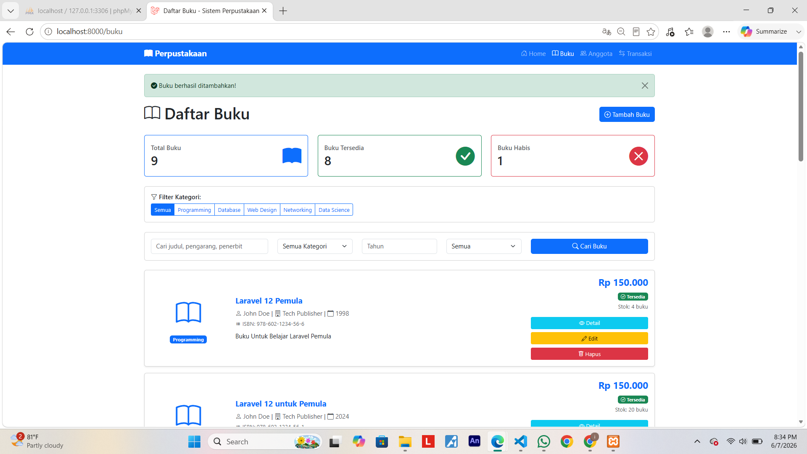
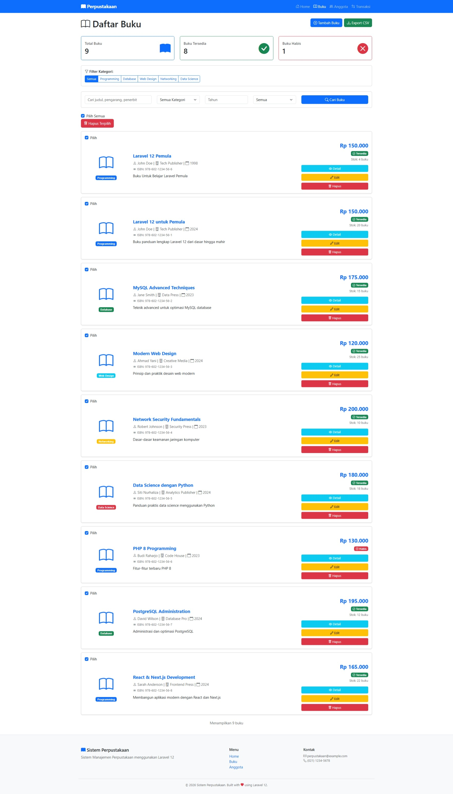
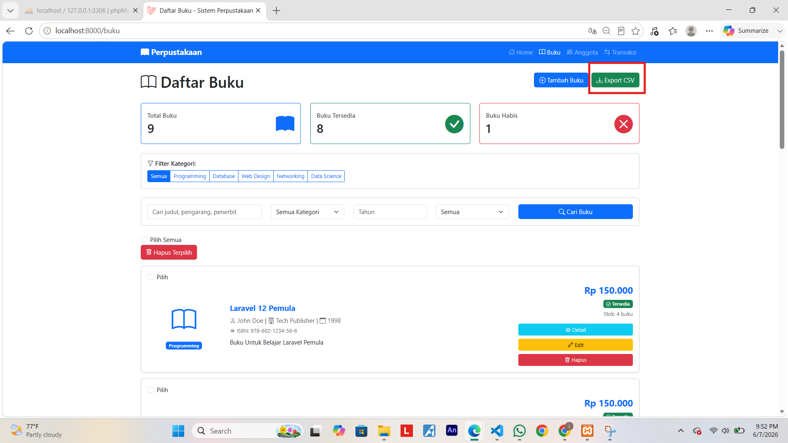
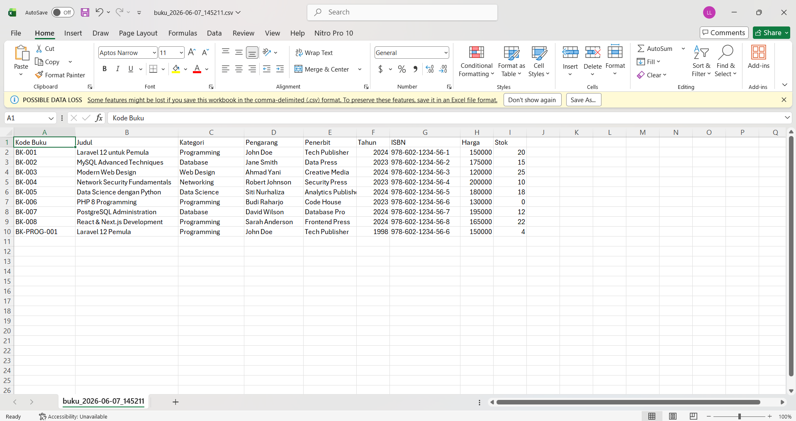

# Tugas Pertemuan 12 - CRUD BUKU DENGAN LARAVEL

---

**Nama:** Isnaeni Kholifatun  
**NIM:** 60324075  
**Prodi:** Informatika  
**Semester:** 4  
**Mata Kuliah:** Pemrograman Web II  
**Repository:** [https://github.com/isnaenikholifatun/Tugas-Pertemuan12-CRUD-BUKU-DENGAN-LARAVEL/tree/main/tugas-pertemuan12]

---

## Tugas 1 : Custom Validation Rule untuk Kode Buku
* Format:`BK-[kategori singkat]-[nomor]`
* Contoh: `BK-PROG-001`, `BK-DB-002`
* Buat custom validation rule
---

**Conditional Validation dan Costum Error Message Indoensia**
* Jika kategori "Programming", field `bahasa` harus "Inggris"
* Jika tahun terbit < 2000, stok maksimal 5
* Semua error message harus dalam bahasa Indonesia yang baik

---

**Perintah yang dijalankan:**
* `php artisan make:rule KodeBukuFormat` 

#### Screenshoot

**Komponen Yang Dibuat:**
---

**StoreBukuRequest:**
Untuk memvalidasi data saat `create` buku baru
Validasi yang diterapkan:
* Kode buku wajib diisi
* Kode buku harus unik
* Kategori harus valid
* Harga tidak boleh negatif
* Stok tidak boleh negatif
* Tahun terbit harus valid

**UpdateBukuRequest:**
Validasi untuk data saat `edit` buku

**Custom Rule KodeBukuFormat:**
Format kode buku:
`BK-XXX-000`
Contoh:
* `BK-PROG-001`
* `BK-WEB-002`
* `BK-NET-003`
---

**Screenshot:**
---
#### 1. Validasi - Input Tidak Valid

#### 2. Validasi - Data Input Valid

#### 3. Hasil Validasi - Input Valid

---

## Tugas 2 : Bulk Delete Operations
---
**Fitur Yang DiTambah:**
* Checkbox pada setiap buku
* Checkbox Pilih Semua
* Tombol Hapus Terpilih
* Hapus banyak data sekaligus

#### Tampilan Bulk Delete:
* Fitur ini memudahkan pengguna untuk memilih banyak buku kemudian mengapus dalam satu fitur itu hapus semua jadi mudah tidak perlu satu-satu.
---

**Hasil Bulk Delete:**

---

## Tugas 3 : Export Buku ke CSV

**Fitur Export CSV:**
* Export Seluruh Data Buku
* Downdload Otomatis `file CSV`
* Dapat dibuka melalui `Microsoft Excel` 
---

**Data Yang diExport:**
* Kode Buku
* Judul
* Kategori
* Pengarang
* Penerbit
* Tahun Terbit
* ISBN
* Harga
* Stok
---

**Hasil Fitur Export CSV:**

#### 1. Fitur Export File CSV

#### 2. Hasil File CSV Sudah DiDowndload
